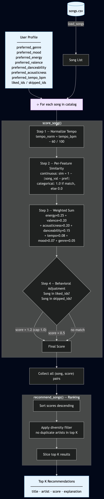

# Music Recommender Simulation

## Project Summary

This project is a content-based music recommender built in Python. It scores every song in a 20-track catalog against a user's taste profile and returns the top K matches with human-readable explanations. The system models user preference across seven audio dimensions — energy, valence, acousticness, danceability, tempo, mood, and genre — and combines them into a single relevance score using a weighted sum. Behavioral history (songs previously liked or skipped) is layered on top as a final score adjustment, mirroring the signal prioritization used by platforms like Spotify and SoundCloud.

---

## Data Flow



---

## How The System Works

The recommender runs each song through a four-step scoring pipeline and returns
the top N matches ranked by relevance score.

---

### The Two Core Objects

**`Song`** — stores the raw features loaded from `data/songs.csv`

| Field | Type | Role |
|---|---|---|
| `id` | int | Unique identifier |
| `title` | string | Display only, not scored |
| `artist` | string | Display only, used for diversity in ranking |
| `genre` | string | Categorical — scored as match / no-match |
| `mood` | string | Categorical — scored as match / no-match |
| `energy` | float 0–1 | Continuous — scored by distance to preference |
| `valence` | float 0–1 | Continuous — scored by distance to preference |
| `danceability` | float 0–1 | Continuous — scored by distance to preference |
| `acousticness` | float 0–1 | Continuous — scored by distance to preference |
| `tempo_bpm` | float | Continuous — normalized before scoring |

**`UserProfile`** — mirrors the song's scoreable features and adds behavioral history

| Field | Type | Role |
|---|---|---|
| `name` | string | Display only |
| `preferred_genre` | string | Categorical target |
| `preferred_mood` | string | Categorical target |
| `preferred_energy` | float 0–1 | Numeric target |
| `preferred_valence` | float 0–1 | Numeric target |
| `preferred_danceability` | float 0–1 | Numeric target |
| `preferred_acousticness` | float 0–1 | Numeric target |
| `preferred_tempo_bpm` | float | Numeric target — normalized at score time |
| `liked_ids` | list[int] | Songs to boost after scoring |
| `skipped_ids` | list[int] | Songs to penalize after scoring |

---

### The Scoring Pipeline

Every song passes through four sequential steps to produce a final relevance
score between `0.0` and `1.0`.

#### Step 1 — Normalize Tempo

`tempo_bpm` is the only feature not already on a 0–1 scale.
Before scoring, both the song's tempo and the user's preferred tempo are
converted:
```
tempo_norm = (tempo_bpm - 60) / (160 - 60)
```

#### Step 2 — Per-Feature Similarity

For each **continuous** feature, similarity is measured by closeness to the
user's preference — not by raw value. A song at the exact preference scores
`1.0`; maximum distance scores `0.0`.
```
similarity = 1 - |song_value - user_preference|
```

For **categorical** features (genre, mood), the rule is binary:
```
score = 1.0  if song value matches user preference
score = 0.0  if it does not
```

#### Step 3 — Weighted Sum

Each feature similarity is multiplied by its weight and summed.
Weights reflect how strongly each dimension predicts listener satisfaction,
informed by how Spotify and SoundCloud weight their own audio features.
```
raw_score = (energy_sim       × 0.25)
          + (valence_sim      × 0.20)
          + (acousticness_sim × 0.20)
          + (danceability_sim × 0.15)
          + (tempo_sim        × 0.08)
          + (mood_score       × 0.07)
          + (genre_score      × 0.05)
```

> **Why these weights?**
> `energy` and `valence` are Spotify's two primary axes for audio analysis.
> `acousticness` strongly separates production styles that genre labels often
> miss. `genre` receives the lowest weight because the continuous features
> already implicitly encode it — giving it more weight would double-count the
> same signal.

#### Step 4 — Behavioral Adjustment

After the weighted sum, the user's listening history adjusts the score.
This runs last so behavioral signals modify relevance without corrupting the
feature similarity math.
```
if song in skipped_ids AND liked_ids  →  score × 0.5  (conflict: skip wins, surfaced in explanation)
if song in skipped_ids                →  score × 0.5
if song in liked_ids                  →  score × 1.2  (capped at 1.0)
```

---

### Scoring vs. Ranking

The scoring rule evaluates **one song in isolation**. The ranking layer then sorts all scores and applies list-level rules — for example, no duplicate artists in the top 5 — before producing the final recommendation list. These are intentionally separate steps. A song can score highly but be displaced by a diversity rule, and the two reasons for exclusion stay independently debuggable.

**Per-song scoring:**

1. Compute per-feature similarity between song and user profile
2. Multiply each similarity by its weight and sum to a raw score
3. Apply behavioral adjustment (liked / skipped history)

**List-level ranking:**

4. Collect all scores and sort descending
5. Apply diversity filter (e.g. no duplicate artists in top 5)
6. Return top N recommendations

---

## Getting Started

### Setup

1. Create a virtual environment (optional but recommended):

   ```bash
   python -m venv .venv
   source .venv/bin/activate      # Mac or Linux
   .venv\Scripts\activate         # Windows
   ```

2. Install dependencies:

   ```bash
   pip install -r requirements.txt
   ```

3. Run the recommender:

   ```bash
   python src/main.py
   ```

### Running Tests

```bash
pytest tests/ -v
```

---

## Experiments

### Baseline — Alex (pop/happy, moderately upbeat)

Alex's continuous preferences closely match the audio profile of pop and indie pop tracks. Rooftop Lights and Fuego Lento both scored 1.00 after the liked-song boost was applied and capped. Sunrise City ranked third on genre and mood match alone, showing the scoring works correctly when behavioral signals are absent.

### Adversarial Profile 1 — Jordan (genre-locked, feature-opposite)

Jordan declared `preferred_genre: "pop"` and `preferred_mood: "happy"` but set every continuous preference in the opposite direction — near-zero energy, very low valence, high acousticness, slow tempo. The top five results were Pine Road, Moonlit Sonata, Spacewalk Thoughts, 3 AM Blues, and Library Rain — all slow, quiet, and acoustic. Not a single pop song appeared.

This confirmed that the 80% continuous-feature weight correctly dominates genre labels when the two signals conflict, which is intentional and consistent with how Spotify weights audio similarity over categorical tags.

### Adversarial Profile 2 — Riley (liked and skipped conflict)

Riley's profile placed song IDs 1 and 5 (Sunrise City, Gym Hero) in both `liked_ids` and `skipped_ids`. Before the fix, the `elif` in the scoring code silently applied only the skip penalty, dropping the like signal with no explanation. After the fix, the reason string now reads `"penalized: skipped (overrides prior like)"` so the conflict is visible in the output. Both songs were absent from Riley's top 5, replaced by tracks with no behavioral signals attached.

---

## Limitations and Risks

- **Tiny catalog.** Twenty hand-curated songs cannot represent real musical diversity. Genres like K-pop, classical Indian, Afrobeats, and jazz are absent or have one track, so users whose taste lives in those areas will always get poor matches.
- **No collaborative filtering.** The system has no concept of what similar users enjoy. It can only match audio features, not discover songs that fans of a given artist tend to like.
- **Static preferences.** Taste changes over time. A user who loved high-energy tracks six months ago but now prefers lo-fi gets no recency adjustment — liked and skipped signals carry equal weight regardless of when they happened.
- **Flat genre labels.** "Pop" covers Billie Eilish and Dua Lipa. The binary genre match treats them identically, which is a significant oversimplification.
- **No lyrics, language, or cultural context.** Two songs can have identical audio features but feel completely different based on language, theme, or cultural origin. The system cannot distinguish them.
- **Tempo normalization range.** The formula assumes tempo is between 60 and 160 BPM. Values outside this range produce unexpected similarity scores.

---

## Reflection

Building this system made clear how much work a seemingly simple number does. A score between 0.0 and 1.0 looks clean, but it collapses seven different dimensions of taste into a single value — and the weights that do the collapsing encode real assumptions about what matters. Choosing to give genre only 5% weight while energy gets 25% is a design decision with consequences: a user who says they want pop but listens like they want folk will get folk, and the system will not explain why their stated preference was overruled.

The adversarial profiles also showed that real-world recommenders face exactly this tension. Spotify does not rely heavily on genre labels for the same reason — audio features generalize better. But that choice means the system can quietly contradict what a user thinks they asked for. The gap between what a user says they want and what the system infers they want is where bias and frustration both live. Human judgment — in choosing weights, deciding which signals to trust, and deciding when to surface conflicts rather than silently resolve them — is still the most important part of building a fair recommender.

---

[**Model Card**](model_card.md)
