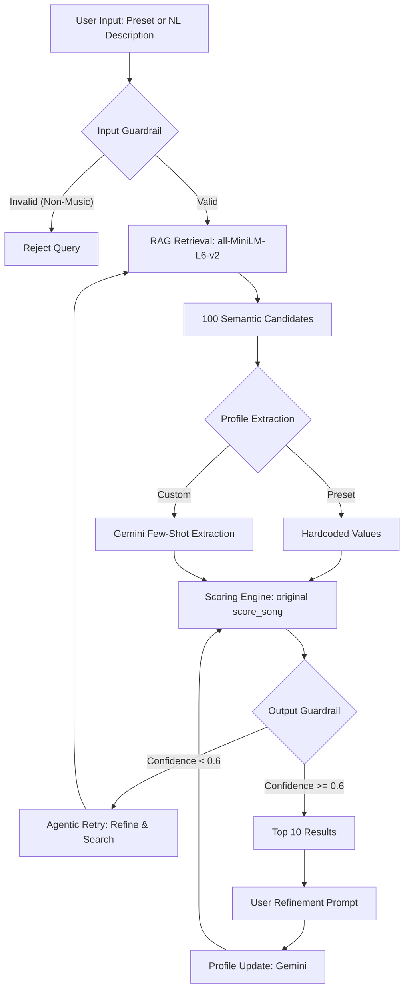

# VibeMatch AI — Semantic Music Recommender

## Original Project

This project extends **VibeMatch 1.0**, a content-based music recommender built in Modules 1–3 of CodePath Ai110. The original system scored a hand-curated 20-track catalog against a hardcoded user profile using a six-feature weighted sum (energy, valence, acousticness, danceability, tempo, genre). It demonstrated the fundamentals of feature similarity scoring and behavioral signals (liked/skipped history), but required manually specifying numeric preferences and could only search 20 songs.

---

## What This Project Does

VibeMatch AI extends the original recommender into a full applied AI system. A user selects from a menu of preset listening profiles — or describes what they want in plain English — and the system returns tailored recommendations from an 81,000-track Spotify catalog. After seeing the initial results, the user can refine with a follow-up prompt ("more upbeat", "less acoustic") and the system re-ranks without re-searching.

The original `score_song()` and `recommend_songs()` functions are preserved as the reranking engine. All new functionality — preset profiles, semantic search, natural language understanding, guardrails, and agentic retry — wraps around them.

---

## System Architecture


### Component Overview



Note on Genre Filtering: If the user’s profile specifies a preferred genre, the system prioritizes candidates matching that genre within the top 100 retrieved by semantic search. If at least 5 matches are found, only those are kept; otherwise, genre matches are simply placed first. This acts as a post-processing filter to ensure the vector search stays within the requested musical style.

---

## Setup Instructions

### Prerequisites

- Python 3.10
- A Google Gemini API key (model: `gemma-3-27b-it`)
- The Kaggle Spotify Tracks dataset ([download here](https://www.kaggle.com/datasets/maharshipandya/-spotify-tracks-dataset)) — save as `data/dataset.csv`

### 1. Clone and create virtual environment

```bash
git clone https://github.com/your-username/MusicRecommender.git
cd MusicRecommender
python3.10 -m venv .venv
source .venv/bin/activate   # Windows: .venv\Scripts\activate
```

### 2. Install dependencies

```bash
pip install -r requirements.txt
```

### 3. Configure API key

```bash
cp .env.example .env
# Edit .env and add your Gemini API key:
# GEMINI_API_KEY=your_key_here
```

### 4. Prepare the data catalog (run once)

```bash
python scripts/prepare_data.py --input data/dataset.csv
```

### 5. Build the embedding index (run once — takes 10–20 minutes)

```bash
python scripts/build_index.py
```

This generates `data/embeddings.npy` (~175MB). It is excluded from git and must be built locally.

### 6. Run the AI agent

```bash
python src/main.py --agent
```

### 7. Run the original rule-based recommender

```bash
python src/main.py
```

### 8. Run tests (zero API calls — fully mocked)

```bash
.venv/bin/python -m pytest tests/ -v
```

### 9. Run the evaluation harness

```bash
python tests/test_harness.py
```

---

## Sample Interactions

### Example 1 — Preset profile

```
Choose a vibe:
────────────────────────────────────────
  1. Late Night Drive
     Moody, mid-tempo tracks for cruising after dark
  2. Gym / Workout
     High-energy, driving tracks to push through a hard session
  3. Focus / Study
     Calm, low-distraction background music for deep work
  4. Party Mode
     Upbeat, danceable bangers to keep the energy high
  5. Rainy Day / Melancholy
     Soft, introspective songs for a quiet, reflective mood
  6. Feel-Good Classics
     Warm, familiar tracks with positive energy
  7. Describe my own vibe...
────────────────────────────────────────
Enter a number (1–7): 1

Loading profile: Late Night Drive...

Top 10 for "Late Night Drive":
Confidence: 0.78  |  Attempts: 1
────────────────────────────────────────
 1. N.Y. State of Mind — Nas
    hip-hop | score: 0.84
 2. C.R.E.A.M. — Wu-Tang Clan
    hip-hop | score: 0.81
...

Refinement: make it more aggressive and faster

Top 10 refined results:
────────────────────────────────────────
 1. Shook Ones Pt. II — Mobb Deep
    hip-hop | score: 0.88
    matches your preferred genre (hip-hop); energy is close to your preference (0.91)
...
```

### Example 2 — Custom vibe with refinement

```
Enter a number (1–7): 7

Describe what you want to listen to: calm acoustic songs for late night studying

Top 10 for "calm acoustic songs for late night studying":
Confidence: 0.82  |  Attempts: 1
────────────────────────────────────────
 1. Holocene — Bon Iver
    indie | score: 0.89
...

Refinement: something more instrumental, no vocals

Top 10 refined results:
────────────────────────────────────────
 1. Experience — Ludovico Einaudi
    classical | score: 0.91
    acousticness matches your taste (0.92); energy is close to your preference (0.18)
...
```

### Example 3 — Invalid query rejected by guardrail

```
Describe what you want to listen to: write me a Python function

Rejected: This does not appear to be a music recommendation request.
```

---

## Design Decisions

**Why preset profiles?**
Preset profiles skip the Gemini (gemma-3-27b-it) profile extraction call entirely, saving an API call and making the system usable even when quota is limited. Each preset is a carefully tuned set of numeric feature values that the scoring engine can use directly. Users who want more control can still describe their own vibe and go through the full NL extraction flow.

**Why remove mood?**
The original mood labels (happy, intense, chill, melancholic, neutral) were derived from energy and valence thresholds — meaning mood carried no information that wasn't already captured by those two features. 53% of the catalog was labeled "neutral", making mood-based filtering nearly useless. Removing it simplifies the data pipeline, eliminates a column from every song dict, and redistributes its 7% weight to the features that actually drive result quality.

**Why keep the original scoring engine?**
The weighted feature sum is a well-calibrated reranker. Its weights reflect which audio features best predict listener satisfaction. Adding semantic search on top improves candidate quality without replacing logic that was already working. The updated weights are: energy 28%, valence 23%, acousticness 22%, danceability 17%, tempo 5%, genre 5%.

**Why HuggingFace sentence-transformers instead of a Gemini embedding call?**
`all-MiniLM-L6-v2` (HuggingFace) runs locally, costs nothing, and produces high-quality semantic embeddings for music descriptions. Local embeddings are also reproducible — the same query always returns the same candidates.

**Why few-shot prompting for profile extraction?**
Four worked examples in the prompt calibrate Google Gemini (gemma-3-27b-it)'s output to the music domain without any model training. Without examples, Gemini produces inconsistent JSON structures. With them, field names and value ranges are stable across diverse queries.

**Why two-stage refinement instead of re-running the full pipeline?**
Re-running the full pipeline on a refinement discards the 100 semantically relevant candidates already retrieved. Re-scoring the same pool with an updated profile is faster, cheaper, and keeps results anchored to the original intent.

**Why retry on low confidence?**
The output guardrail (Google Gemini, gemma-3-27b-it) catches cases where the semantic search retrieved musically adjacent but mismatched songs. The retry appends the guardrail's flag message to the query before re-searching. In testing, one retry is usually sufficient to cross the 0.6 confidence threshold.

---

## Testing Summary

**Unit tests — 30 tests, 0 failures, 0 API calls**

All Gemini (gemma-3-27b-it) calls accept `mock=True`, which returns fixed fixtures. Tests cover:

| Suite | Tests | What's covered |
|---|---|---|
| `test_recommender.py` | 12 | scoring math, sort order, behavioral boosts/penalties, conflict resolution |
| `test_agent.py` | 10 | full pipeline, invalid query rejection, low-confidence retry, profile shape |
| `test_guardrails.py` | 8 | input validation pass/fail, output confidence scoring, API error fallback |

**Evaluation harness — 10/10 fixtures passed**

10 predefined queries ran in mock mode. All returned ≥ 5 results with confidence ≥ 0.6. Average confidence: 0.85.

**Live testing observations:**

- Preset profiles return results immediately with no Gemini (gemma-3-27b-it) call for profile extraction, saving quota.
- Genre-specific queries consistently return genre-appropriate results after the genre pre-filter.
- The confidence guardrail (Google Gemini, gemma-3-27b-it) correctly scored 0.20 for metal results returned against a rap query, demonstrating it catches bad outputs rather than silently accepting them.
- Refinement prompts consistently shift audio feature targets in the expected direction.

---

## Reflection and Ethics

**Limitations and biases**

Mood labels have been removed from the system entirely — they were derived from energy and valence thresholds and carried no independent signal. Genre labels from the Kaggle dataset are inconsistent; the same song may appear under "hip-hop" in one version and "rap" in another, which the genre pre-filter cannot reconcile. The system has no concept of song quality or popularity — a well-known classic and an obscure track with identical audio features score identically.

**Misuse potential**

The input guardrail (Google Gemini, gemma-3-27b-it) prevents the system from being used as a general-purpose chatbot, but a determined user could frame off-topic requests as music queries. The system has no content moderation — it cannot filter for explicit content or age-appropriate material. Gemini could produce hallucinated JSON profiles that silently set extreme feature values, though defaults are applied if any field is missing.

**Surprises during reliability testing**

The most surprising result was how effectively the output guardrail (Google Gemini, gemma-3-27b-it) detected bad recommendations — scoring 0.20 confidence for metal songs returned against a rap query, well below the 0.6 retry threshold. The guardrail's flag message was used as the retry signal to correct the query automatically.

**Collaboration with AI**

Claude was used throughout this project for architecture planning, code generation, and debugging. Helpful suggestions included the two-stage retrieval design, the preset profile menu, and removing mood labels as a redundant feature. One flawed suggestion was the initial monkeypatch strategy in the test suite, which patched `guardrails.validate_input` instead of `agent.validate_input`. Because `agent.py` imports the function directly, the patch had no effect and tests silently passed for the wrong reason — only fixed once the Python import binding behavior was understood.

---

## File Structure

```
MusicRecommender/
  src/
    recommender.py      — scoring engine (score_song, recommend_songs)
    embedder.py         — RAG layer: load index, semantic search
    agent.py            — orchestrator: preset profiles, profile extraction, retry loop
   guardrails.py       — input/output validation via Google Gemini (gemma-3-27b-it)
    main.py             — CLI entry points: preset menu + custom vibe input
  scripts/
    prepare_data.py     — one-time: clean Kaggle CSV → kaggle_tracks.csv
    build_index.py      — one-time: encode catalog → embeddings.npy
  data/
    songs.csv           — original 20-track catalog (Module 1, unchanged)
    kaggle_tracks.csv   — 81k-track production catalog (generated, not committed)
    embeddings.npy      — 81k embeddings @ 384 dims (generated, not committed)
  tests/
    test_recommender.py — 12 unit tests for scoring engine
    test_agent.py       — 10 integration tests for agentic pipeline
    test_guardrails.py  — 8 tests for input/output guardrails
    test_harness.py     — evaluation harness: 10 fixtures, pass/fail report
  requirements.txt
  .env.example
  README.md
  model_card.md
```

---

[**Model Card**](model_card.md)