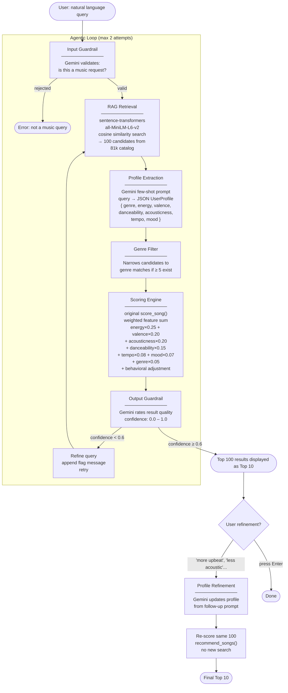

# Architecture Diagram Source

Paste this into [Mermaid Live Editor](https://mermaid.live), then export as PNG and save as `assets/architecture.png`.

```mermaid
flowchart TD
    A([User: natural language query]) --> B

    subgraph AGENT ["Agentic Loop (max 2 attempts)"]
        B["Input Guardrail\n─────────────\nGemini validates:\nis this a music request?"]
        B -->|rejected| ERR([Error: not a music query])
        B -->|valid| C

        C["RAG Retrieval\n─────────────\nsentence-transformers\nall-MiniLM-L6-v2\ncosine similarity search\n→ 100 candidates from 81k catalog"]

        C --> D["Profile Extraction\n─────────────\nGemini few-shot prompt\nquery → JSON UserProfile\n{ genre, energy, valence,\n  danceability, acousticness,\n  tempo, mood }"]

        D --> E["Genre Filter\n─────────────\nNarrows candidates to\ngenre matches if ≥ 5 exist"]

        E --> F["Scoring Engine\n─────────────\noriginal score_song()\nweighted feature sum\nenergy×0.25 + valence×0.20\n+ acousticness×0.20\n+ danceability×0.15\n+ tempo×0.08 + mood×0.07\n+ genre×0.05\n+ behavioral adjustment"]

        F --> G["Output Guardrail\n─────────────\nGemini rates result quality\nconfidence: 0.0 – 1.0"]

        G -->|"confidence < 0.6"| H["Refine query\nappend flag message\nretry"]
        H --> C
    end

    G -->|"confidence ≥ 0.6"| I([Top 100 results displayed as Top 10])

    I --> J{"User refinement?"}
    J -->|"'more upbeat', 'less acoustic'..."| K["Profile Refinement\n─────────────\nGemini updates profile\nfrom follow-up prompt"]
    K --> L["Re-score same 100\nrecommend_songs()\nno new search"]
    L --> M([Final Top 10])
    J -->|press Enter| M2([Done])
```
